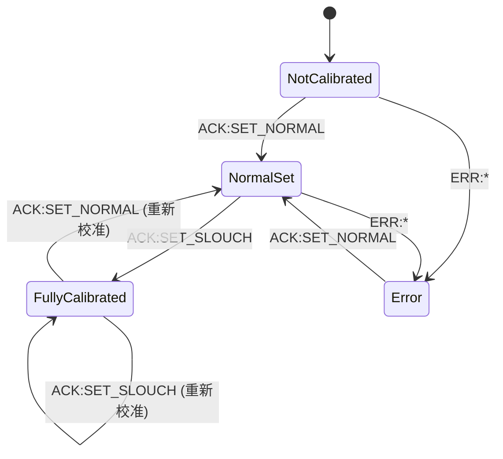
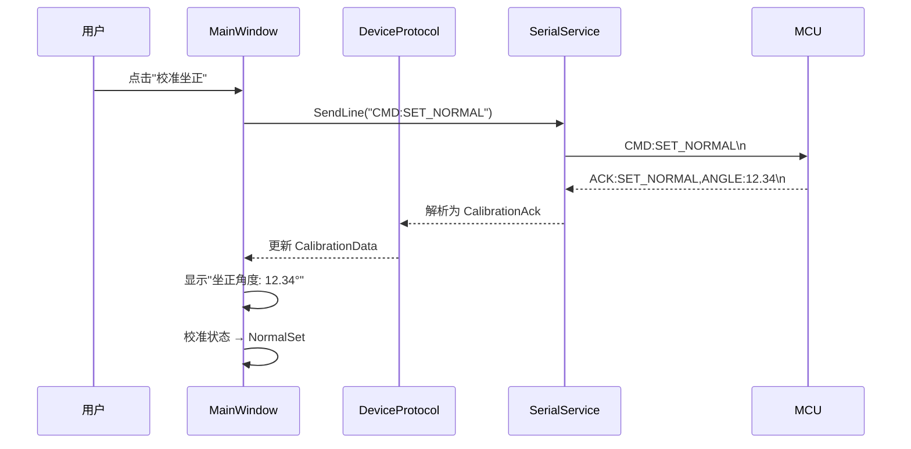

# 串口校准协议设计文档

**创建日期:** 2026-04-02
**状态:** 待实现
**关联文档:** 坐姿矫正仪开发计划 第6章、Plan B (2026-03-23-02-serial-communication.md)

---

## 1. 概述

本文档定义 SitRight 串口双通道协议中校准通道的详细规范，包括：
- PC → MCU 的校准命令格式
- MCU → PC 的校准回包格式（ACK/ERR）
- PC 端软件的解析与状态管理
- 校准 UI 交互流程

当前 DeviceProtocol 仅实现了运行态通道（纯整数 0-100），ACK/ERR 行被当作非法数据丢弃。本文档描述的扩展将使 DeviceProtocol 能够同时处理两种通道。

---

## 2. 协议格式定义

### 2.1 运行态数据（设备 → PC）

格式不变，保持现有实现：

```txt
<number>\n
```

示例：`0`、`37`、`100`

### 2.2 校准命令（PC → 设备）

PC 通过串口向 MCU 发送校准命令，格式为 `CMD:` 前缀 + 命令名称：

| 命令 | 格式 | 含义 |
|------|------|------|
| 校准坐正角度 | `CMD:SET_NORMAL\n` | 用户当前坐姿为"正确"姿态，MCU 记录该角度 |
| 校准驼背角度 | `CMD:SET_SLOUCH\n` | 用户当前坐姿为"驼背"姿态，MCU 记录该角度 |
| 查询校准状态 | `CMD:GET_STATUS\n` | 查询 MCU 当前校准状态（可选） |
| 重置校准 | `CMD:RESET\n` | 清除 MCU 存储的所有校准数据（可选） |

### 2.3 校准回包 ACK（设备 → PC）

MCU 成功执行校准命令后回复 ACK，格式为 `ACK:` 前缀：

```txt
ACK:<COMMAND>,<KEY>:<VALUE>,<KEY>:<VALUE>\n
```

示例：

```txt
ACK:SET_NORMAL,ANGLE:12.34\n
ACK:SET_SLOUCH,ANGLE:25.67\n
ACK:GET_STATUS,NORMAL:12.34,SLOUCH:25.67,STATUS:CALIBRATED\n
ACK:RESET\n
```

### 2.4 校准回包 ERR（设备 → PC）

MCU 无法执行命令时回复 ERR，格式为 `ERR:` 前缀：

```txt
ERR:<ERROR_CODE>\n
```

| 错误码 | 含义 |
|--------|------|
| `BUSY` | 设备正忙，无法执行校准（正在采集数据中） |
| `UNKNOWN_CMD` | 未识别的命令 |
| `NO_SENSOR` | 传感器未连接或初始化失败 |
| `CALIBRATION_FAILED` | 校准过程失败（数据异常等） |

示例：

```txt
ERR:BUSY\n
ERR:UNKNOWN_CMD\n
```

---

## 3. DeviceProtocol 扩展设计

### 3.1 解析结果类型

当前 `TryParse` 返回 `bool` + `out int`。扩展后需要区分三种情况：

```csharp
public enum ProtocolLineType
{
    RuntimeData,     // 运行态数据：纯整数 0-100
    CalibrationAck,  // 校准确认：ACK:...
    CalibrationErr   // 校准错误：ERR:...
}

public record CalibrationAckData(string Command, Dictionary<string, string> Fields);
public record CalibrationErrData(string ErrorCode);
```

### 3.2 解析接口设计

保留现有 `TryParse` 向后兼容，新增解析方法：

```csharp
// 现有方法保持不变（仅处理运行态数据）
public bool TryParse(string? line, out int value)

// 新增：完整协议行解析
public bool TryParseFull(string? line, out ProtocolLineType type, out int runtimeValue,
    out CalibrationAckData? ack, out CalibrationErrData? err)
```

### 3.3 解析规则

1. 输入为空/空白 → 返回 false
2. 输入以 `ACK:` 开头 → 解析为 CalibrationAck
   - 提取命令名（第一个逗号前）
   - 剩余部分按 `KEY:VALUE` 格式解析到字典
3. 输入以 `ERR:` 开头 → 解析为 CalibrationErr
   - 提取错误码（`ERR:` 后的全部内容）
4. 其他 → 尝试解析为整数 0-100（运行态数据）

---

## 4. 校准状态管理

### 4.1 新增模型

```csharp
public enum CalibrationState
{
    NotCalibrated,    // 未校准
    NormalSet,        // 已校准坐正角度
    FullyCalibrated,  // 完全校准（坐正+驼背）
    Error             // 校准错误
}

public class CalibrationData
{
    public CalibrationState State { get; set; }
    public double? NormalAngle { get; set; }    // 坐正角度
    public double? SlouchAngle { get; set; }    // 驼背角度
    public string? LastError { get; set; }      // 最近错误
    public DateTime? LastCalibrated { get; set; }
}
```

### 4.2 状态转换



---

## 5. 校准 UI 交互流程

### 5.1 MainWindow 新增校准区域

MainWindow 中新增一个 GroupBox "校准控制"，包含：

| 控件 | 功能 |
|------|------|
| "校准坐正" 按钮 | 发送 `CMD:SET_NORMAL`，等待 ACK/ERR |
| "校准驼背" 按钮 | 发送 `CMD:SET_SLOUCH`，等待 ACK/ERR |
| 校准状态文本 | 显示当前 CalibrationState |
| 正常角度显示 | 显示 ACK 返回的角度值 |
| 驼背角度显示 | 显示 ACK 返回的角度值 |

### 5.2 交互时序



### 5.3 错误处理

- 发送校准命令后 3 秒内未收到 ACK/ERR → 超时提示
- 收到 ERR → 显示错误码和中文说明
- 校准期间运行态数据继续正常接收和显示

---

## 6. SerialService 扩展

### 6.1 新增发送方法

```csharp
// ISerialService 新增
void SendLine(string line);
```

### 6.2 实现

```csharp
// SerialService 新增
public void SendLine(string line)
{
    if (_serialPort?.IsOpen == true)
    {
        _serialPort.WriteLine(line);
    }
}
```

---

## 7. 显示器选择功能设计

### 7.1 需求

允许用户选择 Overlay 窗口投射到哪块显示器上。不是多显示器同时覆盖，而是选择单一目标显示器。

### 7.2 技术方案

- 使用 `System.Windows.Forms.Screen.AllScreens` 枚举所有显示器
- 获取每个显示器的 `DeviceName`、`Bounds`（X, Y, Width, Height）
- OverlayWindow 不使用 `WindowState="Maximized"`，改为手动设置窗口位置和大小对齐目标屏幕

### 7.3 模型扩展

```csharp
// AppConfig 新增
public int TargetMonitorIndex { get; set; } = 0;  // 目标显示器索引
```

### 7.4 UI 设计

MainWindow 串口连接区域下方新增：

| 控件 | 功能 |
|------|------|
| "目标显示器" 下拉框 | 列出所有显示器（名称 + 分辨率） |
| 自动检测 | 程序启动时枚举，热插拔时刷新 |

### 7.5 OverlayWindow 行为变更

当前 OverlayWindow 使用 `WindowState="Maximized"` 自动铺满主显示器。改为：

```csharp
// 设置窗口到目标显示器
void SetTargetScreen(Screen screen)
{
    WindowState = WindowState.Normal;
    WindowStyle = WindowStyle.None;
    Left = screen.Bounds.Left;
    Top = screen.Bounds.Top;
    Width = screen.Bounds.Width;
    Height = screen.Bounds.Height;
}
```

---

## 8. 实现优先级

| 优先级 | 任务 | 依赖 |
|--------|------|------|
| P0 | DeviceProtocol 扩展 ACK/ERR 解析 | 无 |
| P0 | SerialService 新增 SendLine | 无 |
| P1 | CalibrationData 模型 + 状态管理 | P0 |
| P1 | 校准 UI（MainWindow 新增校准区域） | P0, P1 |
| P2 | 显示器枚举 + 选择下拉框 | 无 |
| P2 | OverlayWindow 显示器定位 | P2 |

---

## 9. 测试计划

| 测试 | 说明 |
|------|------|
| `DeviceProtocolTests.TryParseFull_ACK` | 验证 ACK 行正确解析为 CalibrationAckData |
| `DeviceProtocolTests.TryParseFull_ERR` | 验证 ERR 行正确解析为 CalibrationErrData |
| `DeviceProtocolTests.TryParseFull_RuntimeData` | 验证运行态数据仍然正常解析 |
| `DeviceProtocolTests.TryParseFull_MixedFields` | 验证 ACK 多字段解析 |
| `CalibrationDataTests.StateTransitions` | 验证校准状态转换逻辑 |
| `ConfigServiceTests.TargetMonitorIndex` | 验证显示器选择配置持久化 |
