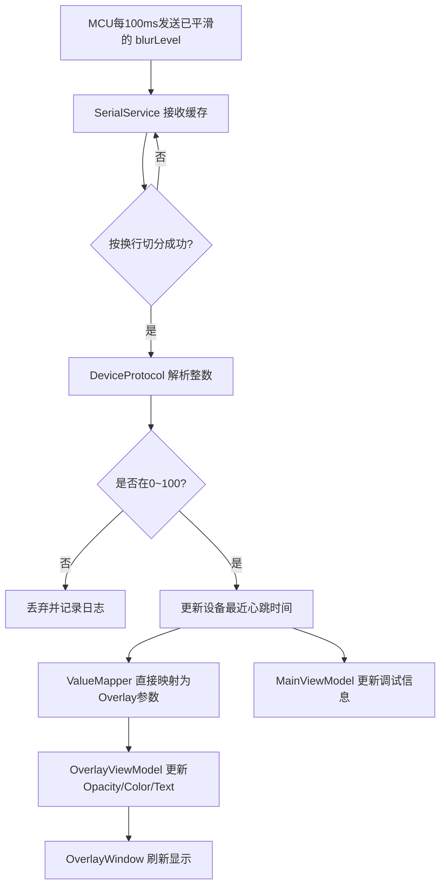
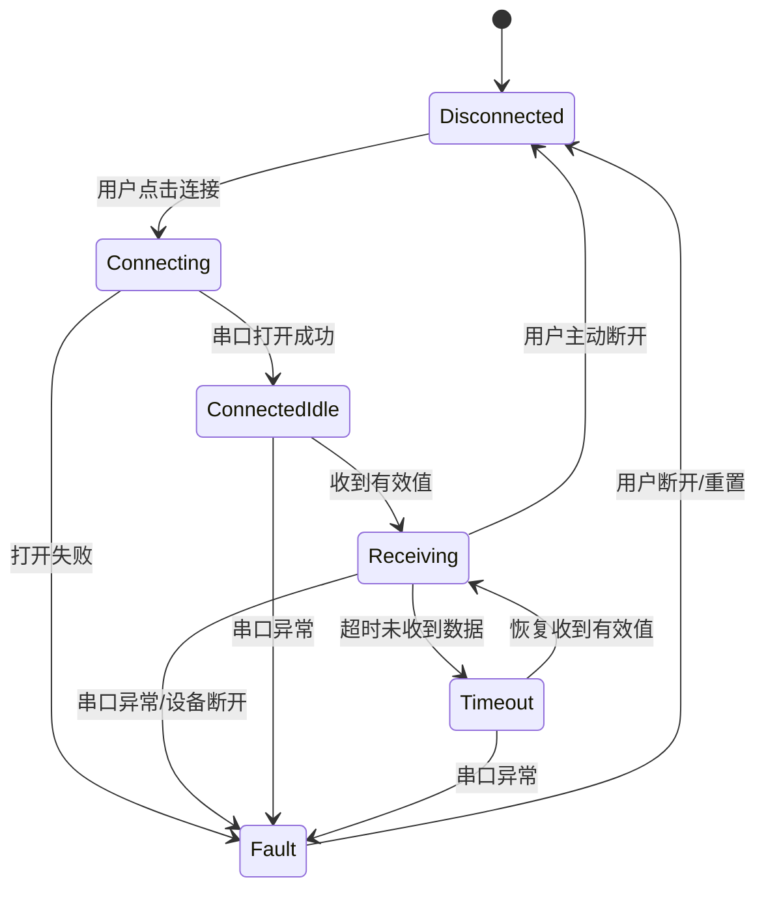
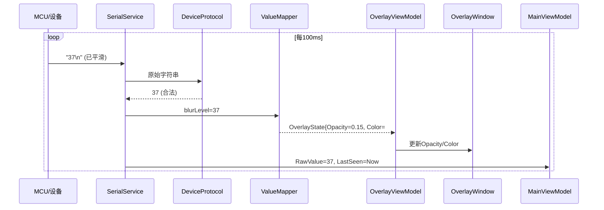

---

# 1. 系统目标与边界

系统运行逻辑是：用户佩戴/放置姿态感知装置，嵌入式设备持续采集姿态相关数据，根据规则计算一个 `blurLevel`，取值范围 `0~100`，越高表示坐姿越差或偏离目标越严重。**平滑算法在硬件端完成**，硬件输出的 blurLevel 已经是稳定、平滑后的值。设备每 100ms 通过 USB 串口向 PC 发送一行数据。PC 上位机接收后，**不做任何平滑处理**，直接将该值映射为 Overlay 的视觉强度，例如遮罩透明度、灰雾强度、暗化程度、提示文字等级。整个系统第一版只保证**单主显示器**，不处理真正桌面实时模糊，不把 Overlay 设计为复杂交互层，优先保证串口稳定、窗口稳定、效果稳定、状态可调试。

第一版约束如下：只支持 Windows；PC 端默认 .NET 桌面环境；只支持一个 USB 设备；串口协议使用纯文本换行形式；Overlay 默认置顶且不考虑复杂点击穿透；如果设备掉线，上位机应自动退回安全状态（遮罩减弱或消失）；如果串口异常，主窗口必须给出明确状态反馈。整个架构应服务于两个目标：一是**演示效果稳定**，二是**后续容易扩展**。

---

# 2. 总体架构

系统从功能上分成三层：**采集计算层、通信层、视觉呈现层**。采集计算层在 MCU 上，负责姿态估计、平滑算法和数值输出；通信层负责 USB 串口传输；视觉呈现层负责接收 blurLevel 并直接映射渲染 Overlay。


如果从部署视角来看，系统是两个物理节点：**姿态设备**和**Windows 电脑**。姿态设备负责生产一个稳定、低频、平滑、可解释的指标（blurLevel）；电脑端只负责把这个指标变成一种直观的视觉反馈。**软硬件职责明确**：硬件端完成采集 + 平滑，软件端只做接收 + 映射 + 渲染。这样做的好处是：嵌入式端和上位机职责清晰，调试时可以单独替换任一侧，例如没有硬件时用滑条模拟 `blurLevel`，硬件正常后再切换为串口输入。

---

# 3. 第一版视觉策略

第一版 Overlay 不做真实桌面采样模糊，而采用“**感知模糊**”方案，即通过半透明白/灰遮罩、轻度暗化、边缘渐变、提示文字和动画平滑让用户主观感受到“屏幕越来越不可用”。这样既能达到行为反馈目的，又规避了 WPF 在透明全屏窗口下做重图形特效的性能和兼容性风险。视觉层应尽量轻量：一个全屏窗口，一个根 Grid，一层主遮罩 Rectangle，一层可选的径向渐变/边缘雾层，一个提示文本区域。参数变化只体现在 `Opacity`、颜色通道、文本内容和少量缩放/淡入动画上，避免叠加多个 BlurEffect 或复杂控件树。

建议将视觉效果分为 4 档：`0~20` 基本透明仅轻提示，`21~50` 明显白雾/浅灰层，`51~80` 白雾增强并伴随暗化，`81~100` 视野受限明显且提示文案升级。虽然底层技术仍是简单透明层，但通过合理的颜色和透明度曲线，视觉主观强度可以做得很自然。

---

# 4. 软件架构设计

电脑端建议使用一个 WPF 项目，内部采用轻量分层，而不是上来做特别重的企业架构。核心是把**串口接入、数值映射、界面呈现**解耦。推荐目录结构如下：

```txt
PostureOverlayApp/
├─ App.xaml
├─ MainWindow.xaml                  // 主控制窗口：连接、调试、状态显示
├─ OverlayWindow.xaml               // 全屏覆盖窗口
├─ Models/
│  ├─ DeviceState.cs                // 设备连接状态、当前值、时间戳
│  ├─ OverlayState.cs               // Overlay相关参数：Opacity、颜色、文本
│  └─ AppConfig.cs                  // 阈值、串口设置、UI配置
├─ Services/
│  ├─ SerialService.cs              // 串口连接、接收、异常处理
│  ├─ DeviceProtocol.cs             // 按行协议解析，字符串转整数
│  └─ ConfigService.cs              // 本地配置读写（json）
├─ ViewModels/
│  ├─ MainViewModel.cs
│  └─ OverlayViewModel.cs
├─ Utils/
│  ├─ ValueMapper.cs                // blurLevel -> Opacity/Color/Text
│  └─ DispatcherHelper.cs           // UI线程切换辅助
└─ Assets/
   └─ optional textures/icons
```

这里最关键的不是形式上的 MVVM，而是每个模块职责明确：`SerialService` 只关心串口；`DeviceProtocol` 只关心”收到一行文本，能否解析成 0~100”；`ValueMapper` 只关心”blurLevel 如何映射成视觉参数”；`OverlayWindow` 只关心”拿到视觉参数如何展示”。**注意：平滑算法在硬件端完成，软件端不包含 BlurController，收到 blurLevel 后直接映射渲染。**

---

# 5. 核心数据流

第一版系统的数据主线非常简单，但每一步都要明确输入、输出和异常策略。MCU 每 100ms 输出一行文本，例如 `”37\n”`，**该值已经过硬件端平滑算法处理，是稳定可用的 blurLevel**。PC 端串口接收到缓冲数据后按换行切分，解析出整数，校验是否在 `[0,100]`。如果合法，则更新设备最近接收时间，并直接将 blurLevel 交给 `ValueMapper` 映射为 Overlay 的 `Opacity`、颜色和提示级别。OverlayWindow 绑定这些属性，实时刷新显示。**软件端不做平滑处理**。若超过一定时间未收到新数据，则视为设备超时，系统进入降级状态：主窗口报警，Overlay 逐步退回低强度或完全清零。



软件端数据流简洁直接：接收 blurLevel → 映射 → 渲染，无中间平滑环节。

---

# 6. 串口协议设计

串口协议为**双通道**设计，硬件和软件通过行首前缀区分消息类型。

### 6.1 运行态数据（设备 → PC）

格式：

```txt
<number>\n
```

示例：

```txt
0
12
37
85
100
```

### 6.2 校准回包（设备 → PC）

当 PC 端发送校准命令后，设备回复 `ACK:` 或 `ERR:` 开头的文本行：

```txt
ACK:SET_NORMAL,ANGLE:12.34\n
ACK:SET_SLOUCH,ANGLE:25.67\n
ERR:BUSY\n
ERR:UNKNOWN_CMD\n
```

ACK/ERR 是协议的必要部分，始终输出，不受 `DEBUG_SERIAL` 编译开关控制。PC 端需通过行首前缀区分运行态数据和校准回包。

### 6.3 校准命令（PC → 设备）

- `CMD:SET_NORMAL\n` — 校准坐正角度
- `CMD:SET_SLOUCH\n` — 校准驼背角度

详见 `docs/plans/2026-04-01-serial-calibration-design.md`。

### 6.4 串口参数

串口参数建议默认：`115200 8N1`。上位机需要支持配置 COM 口名、波特率，并在连接后显示”设备在线、最近值、最后接收时间、错误次数”。

---

# 7. 设备状态机

PC 端必须有明确状态机，否则你后面会发现程序虽然“看起来能跑”，但设备拔掉、接错、无数据等情况下表现非常乱。推荐状态分为：`Disconnected`、`Connecting`、`ConnectedIdle`、`Receiving`、`Timeout`、`Fault`。其中 `ConnectedIdle` 表示串口已开但还没收到有效数据；`Receiving` 表示正在稳定接收；`Timeout` 表示超时未收到新值；`Fault` 表示端口异常或解析连续失败。



这个状态机会直接驱动 UI：例如 `Disconnected` 时 Overlay 默认关闭或透明；`Receiving` 时正常显示；`Timeout` 时 Overlay 逐步减弱并提示“设备无数据”；`Fault` 时主窗口突出错误并建议重连。

---

# 8. Overlay 设计

OverlayWindow 是系统体验核心。它应是一个**全屏、无边框、置顶、不出现在任务栏、背景透明**的窗口。内部内容要非常克制，推荐如下结构：

- 根容器：`Grid`
- 底层：透明背景
- 主遮罩层：铺满全屏的 `Rectangle`
- 可选边缘雾层：一个 `Rectangle` 或 `Border` 使用径向渐变 Brush
- 提示区：中央或顶部 `TextBlock`
- 调试时可选一个小角标显示当前值，正式版关闭

视觉参数由 `OverlayState` 统一提供，包含：
- `MaskOpacity`：主遮罩透明度
- `MaskBrush`：白/灰/冷色雾层颜色
- `EdgeOpacity`：边缘强化
- `MessageText`：如“请调整坐姿”
- `MessageOpacity`
- `SeverityLevel`

映射逻辑建议不是线性的。例如 `blurLevel` 从 0 到 30 时变化较柔和，30 到 70 变化更明显，70 到 100 快速压迫。因为用户对视觉变化不是线性感知，适当使用非线性曲线更自然。比如：

- `MaskOpacity = 0.05 + (level / 100)^1.4 * 0.65`
- `DarkenOpacity = (level / 100)^1.8 * 0.25`
- `MessageOpacity = level > 25 ? min(1, (level - 25)/40) : 0`

这样低值时 Overlay 不会过于敏感，高值时反馈会更果断。

---

# 9. 主控制窗口设计

MainWindow 的职责不是花哨，而是“**确保你在开发和演示时永远知道系统在干什么**”。建议界面至少包括：串口选择下拉框、刷新端口按钮、连接/断开按钮、当前状态、最近接收值、平滑后显示值、最后接收时间、超时阈值、模拟模式开关、显示 Overlay 开关、日志区域。尤其是“模拟模式”很重要，当硬件不在手边时，使用滑条即可模拟 `0~100` 输入，保证上位机独立可开发。

主窗口不是用户主要看的界面，但对你联调至关重要。很多项目失败不是算法不行，而是**没有调试可观测性**，导致任何问题都像“程序玄学”。所以主窗口必须把状态透明化。

---

# 10. 时序设计

下面这张时序图表示一次正常的数据传递过程：MCU 周期发送已平滑的 blurLevel，SerialService 接收并解析，ValueMapper 直接映射，OverlayWindow 刷新界面，MainWindow 同步更新调试信息。



而异常时序应当同样明确：如果 2 秒未收到新数据，状态管理器触发超时，Overlay 逐步退回低强度或完全清零，同时 MainWindow 状态变成 `Timeout`；如果串口直接异常，则进入 `Fault` 状态并触发 UI 错误提示。

---

# 11. 关键模块说明

`SerialService` 负责打开串口、订阅接收事件、缓存拼接、行分割、异常捕获、关闭释放。它不做业务判断，只把”完整的一行字符串”往上送。为了避免线程问题，接收线程不要直接操作 WPF 控件，而是通过事件、回调或消息机制把数据传给 ViewModel 或 Controller，再由 UI 线程更新界面。

`DeviceProtocol` 很简单：输入一行文本，尝试 `trim` 后解析为整数，若失败则拒绝；若成功但越界，也拒绝。它的职责就是”**定义何为合法设备消息**”。

**注意：软件端不包含 BlurController。** 平滑算法在硬件端完成，MCU 输出的 blurLevel 已经是稳定、平滑的值。软件端收到值后直接交给 ValueMapper。

`ValueMapper` 把 blurLevel 直接映射成 UI 参数。其输出不是单一 `Opacity`，而是一个完整的 `OverlayState`。例如同一个 `blurLevel=70`，你可能希望输出：主遮罩 `0.52`、边缘层 `0.18`、提示文案”请调整坐姿”、提示透明度 `0.85`。把这些规则写在一个独立类里，后面你调体验时就不用改 UI 代码。

---

# 12. 推荐的参数默认值

为了尽量一次成功，第一版建议从保守参数起步：MCU 发送周期 100ms，串口波特率 115200；PC 端超时阈值 2000ms；合法输入范围 `[0,100]`；主遮罩最大透明度不超过 `0.70`，否则容易过于激进；低于 5 视为接近无效果；提示文字从 30 以上开始渐显；超过 80 使用更明显提示。这样可以在大部分机器上既流畅又不刺眼。

---

# 13. 运行流程

整个系统完整运行流程如下，从上电到视觉反馈是一个闭环：


对用户来说，这个闭环应该是实时、稳定且“没有明显跳变”的。对开发者来说，每一环都应该能单独测试：设备端可用串口助手看输出，上位机可用模拟滑条代替串口输入，Overlay 可脱离硬件先调效果。

---

# 14. 失败模式与降级策略

第一版一定要考虑失败模式，否则展示时设备一抖就乱。典型失败包括：串口未连接、串口被占用、收到非法文本、设备拔掉、长时间无数据、值剧烈抖动、窗口未正确显示。降级策略统一遵循“**对用户无害、对开发者可见**”：如果设备无数据，Overlay 应逐步减弱而不是停留在高惩罚状态；如果串口异常，MainWindow 必须显式报错；如果解析失败，丢弃该帧并计数，但不要让整个程序崩溃；如果用户关闭 Overlay，串口层仍可继续运行并显示数值。

---

# 15. 实现优先级与开发顺序

这部分虽然是步骤，但非常关键，因为顺序错了就会浪费很多时间。最优路径是：先做 WPF 项目骨架和主窗口；再做 OverlayWindow，使用滑条控制遮罩强度，确认全屏置顶和透明显示没问题；然后实现 ValueMapper 数值映射，让遮罩变化具备合理的非线性映射；再接 `SerialService`，先用固定字符串模拟接收，再接真正硬件；最后补状态机、超时处理、配置存储和日志。这个顺序保证你始终能看见”系统正在越来越接近完成”，而不会卡死在某个复杂点。

---

# 16. 配置与可扩展性

第一版就建议把一些关键参数放入配置文件，例如 JSON：默认 COM 口、波特率、超时阈值、最大遮罩透明度、提示文案阈值。这样后面调体验不需要反复改代码重新编译。第二版如果你要扩展多显示器、点击穿透、系统级毛玻璃或更复杂惩罚逻辑，也都可以在现有架构上逐层替换，不需要推倒重来。

---

# 17. 方案摘要

如果把这套方案压缩成一句工程定义，就是：

> **第一版实现一个”姿态评分驱动的桌面视觉干预系统”：设备端稳定输出 0~100 的已平滑 blurLevel，PC 端用 C# WPF 接收后直接映射渲染，在全屏透明顶层 Overlay 中通过轻量级遮罩、渐变雾化、暗化和文案提示构建”感知模糊”效果；系统具备串口连接管理、超时回退、状态可视化和模拟模式，优先保证联调成功率、界面稳定性和后续扩展性。软件端不包含平滑算法，平滑在硬件端完成。**

---

如果你要，我下一条可以继续直接给你两份“能立刻动手”的内容之一：
1. **这个方案对应的 WPF 项目骨架代码模板**，包含 `MainWindow`、`OverlayWindow`、`SerialService`、`ValueMapper` 的最小实现；
2. **项目文档版**，我把上面这份方案整理成更像开题/设计报告的正式写法。
