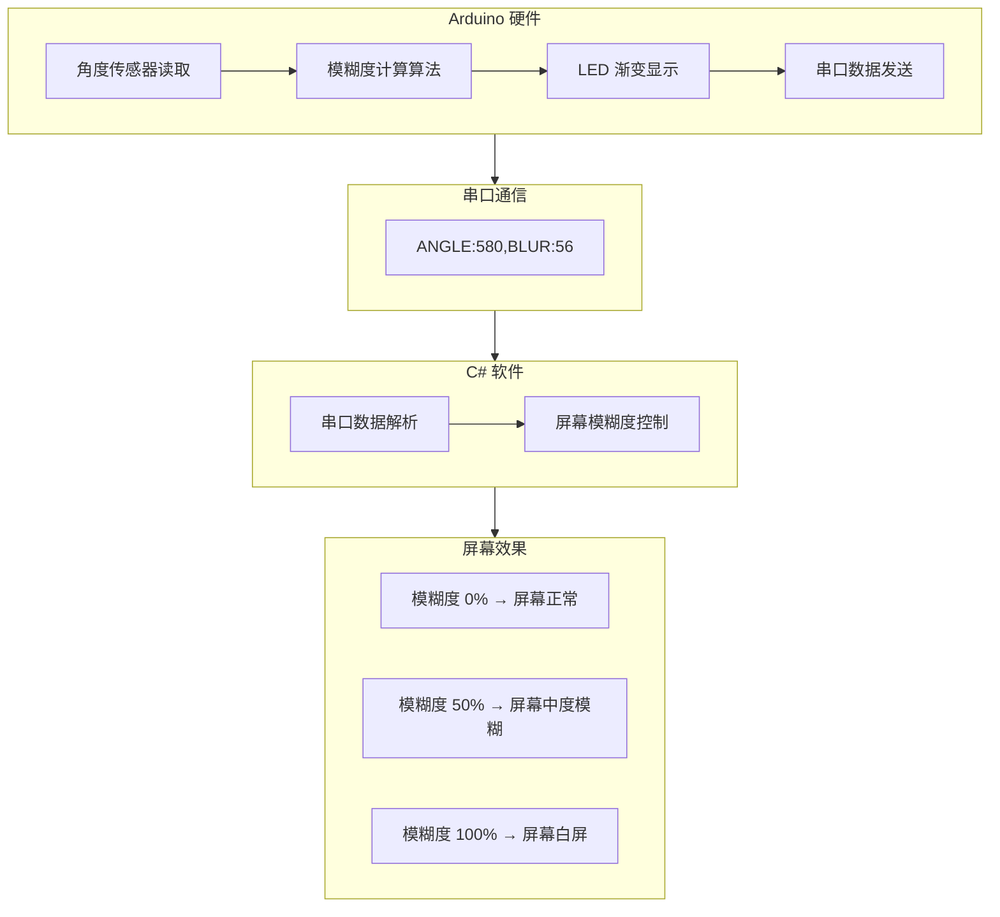
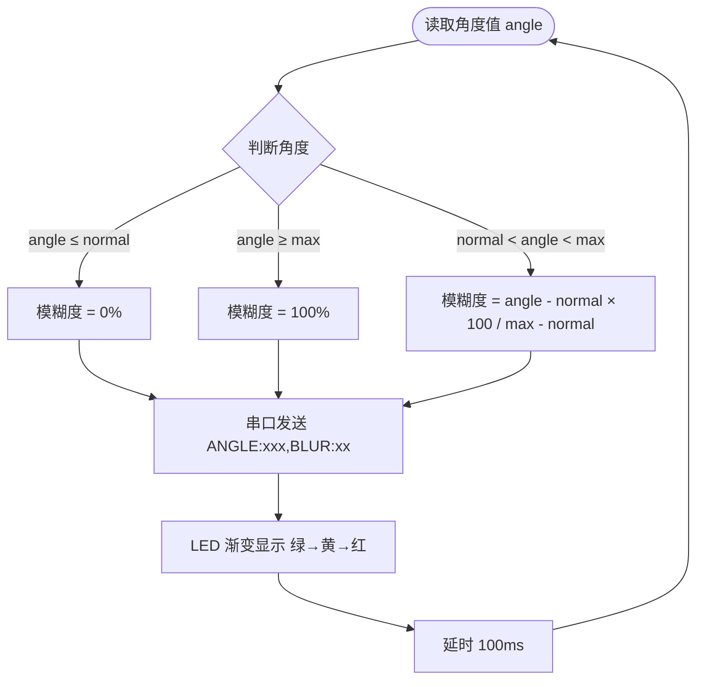

# 坐姿矫正仪 - 软硬件对接说明

## 一、系统架构流程图



---

## 二、模糊度计算流程图



---

## 三、串口通信参数

| 项目 | 值 |
|------|-----|
| 波特率 | 9600 |
| 数据位 | 8 |
| 停止位 | 1 |
| 校验位 | 无 |
| 通信接口 | USB 串口 (虚拟 COM 口) |

---

## 四、数据格式

硬件每 100ms 发送一条数据，格式如下：

```
ANGLE:角度值,BLUR:模糊度
```

**示例：**
```
ANGLE:245,BLUR:0
ANGLE:412,BLUR:32
ANGLE:580,BLUR:56
ANGLE:780,BLUR:96
ANGLE:850,BLUR:100
```

**字段说明：**
- `ANGLE`：角度传感器原始值，范围 0~1023
- `BLUR`：模糊度，范围 0~100（整数）

---

## 五、模糊度计算公式

```
设：
- angle = 当前角度值 (0~1023)
- normal = 用户设定的正常阈值 (默认 300)
- max = 用户设定的最大阈值 (默认 800)

则：
if angle ≤ normal:
    blur = 0
else if angle ≥ max:
    blur = 100
else:
    blur = (angle - normal) × 100 / (max - normal)
```

---

## 六、状态对应表

| 模糊度 | 坐姿情况 | LED 颜色 | 屏幕效果 |
|:------:|---------|---------|---------|
| 0% | 正常 | 绿 | 正常显示 |
| 1-30% | 轻微不端正 | 绿→黄 渐变 | 轻微模糊 |
| 31-70% | 中度不端正 | 黄 | 中度模糊 |
| 71-99% | 严重不端正 | 黄→红 渐变 | 严重模糊 |
| 100% | 最差 | 红 | 白屏 |

---

## 七、用户可调参数

| 参数 | 默认值 | 说明 | 调节方式 |
|------|--------|------|---------|
| normal | 300 | 正常阈值（角度 ≤ 此值 → 模糊度0%） | 按键调节 |
| max | 800 | 最大阈值（角度 ≥ 此值 → 模糊度100%） | 按键调节 |

**按键调节逻辑：**
- 短按按键，交替调节 normal 和 max
- 每次按增加 50
- 调节时串口会输出当前阈值

---

## 八、联调步骤

1. 硬件组烧录代码到 Arduino
2. 打开 Arduino IDE 串口监视器（9600 波特率），确认能看到数据输出
3. 手动转动角度传感器，观察 BLUR 值从 0 到 100 变化
4. 观察 LED 颜色渐变（绿→黄→红）
5. 按按键，确认阈值可调节
6. 软件组打开 C# 程序，确认能接收到数据
7. 转动传感器，观察屏幕模糊度跟随变化
