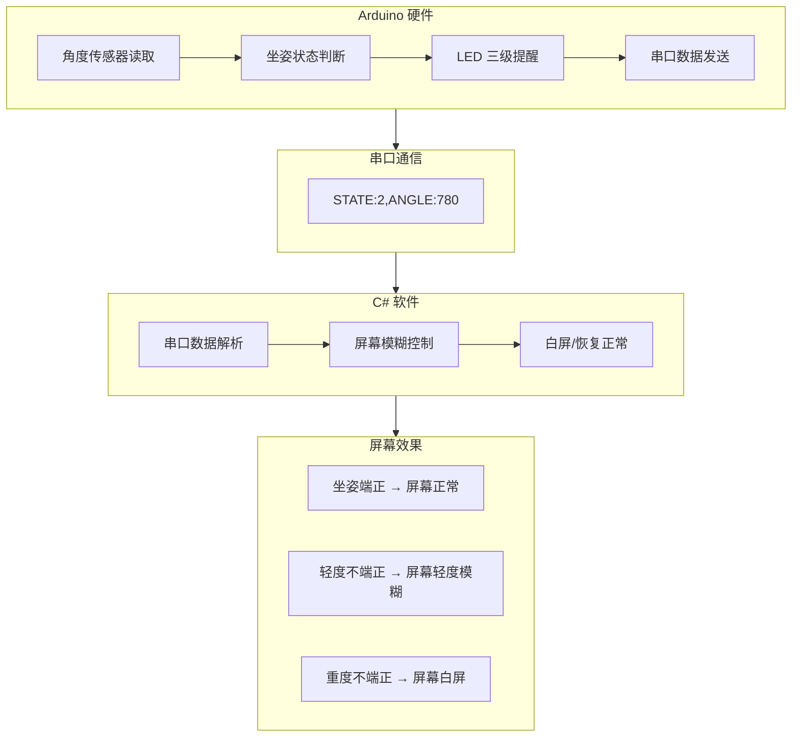
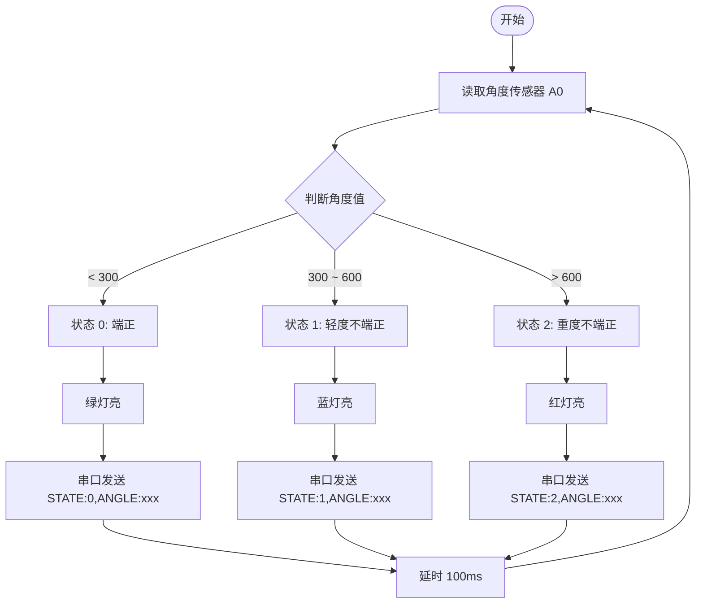
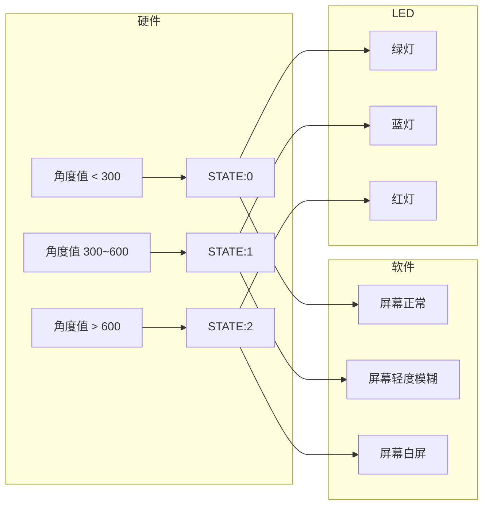

# 坐姿矫正仪 - 软硬件对接说明

## 一、系统架构流程图



---

## 二、硬件工作流程图



---

## 三、数据流简图


---

## 四、状态对应图



---

## 五、串口通信参数

| 项目 | 值 |
|------|-----|
| 波特率 | 9600 |
| 数据位 | 8 |
| 停止位 | 1 |
| 校验位 | 无 |
| 通信接口 | USB 串口 (虚拟 COM 口) |

---

## 六、数据格式

硬件每 100ms 发送一条数据，格式如下：

```
STATE:状态值,ANGLE:角度值
```

**示例：**
```
STATE:0,ANGLE:245
STATE:1,ANGLE:412
STATE:2,ANGLE:780
```

**字段说明：**
- `STATE`：坐姿状态，取值 0、1、2
- `ANGLE`：角度传感器原始值，范围 0~1023

---

## 七、状态定义

| STATE 值 | 坐姿情况 | 硬件 LED 颜色 | 软件屏幕效果 |
|:--------:|---------|-------------|-------------|
| 0 | 端正 |  绿灯 | 屏幕正常 |
| 1 | 轻度不端正 |  蓝灯 | 屏幕轻度模糊 |
| 2 | 重度不端正 |  红灯 | 屏幕白屏 |

---

## 八、软件需要实现的功能

| 步骤 | 任务 |
|------|------|
| 1 | 打开串口（波特率 9600，根据实际 COM 口） |
| 2 | 按行读取数据 |
| 3 | 解析出 STATE 值 |
| 4 | 根据 STATE 控制屏幕效果 |

---

## 九、预计联调步骤

1. 硬件组烧录代码到 Arduino
2. 打开串口监视器，确认能看到数据输出
3. 软件组打开 C# 程序，确认能接收到数据
4. 手动转动角度传感器，观察屏幕效果变化
